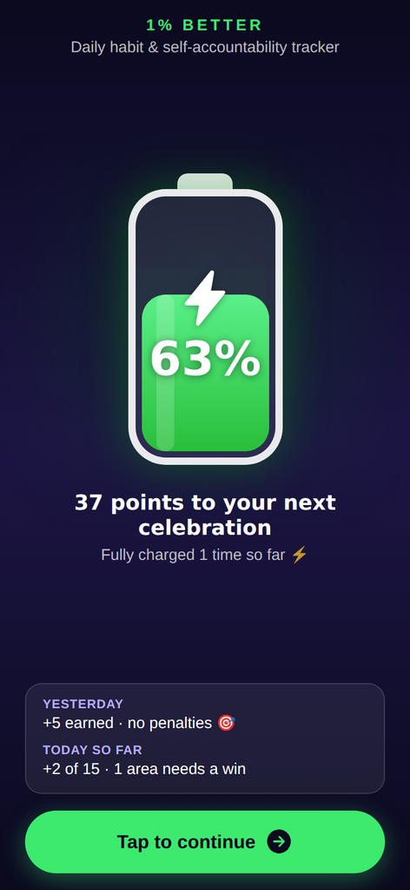
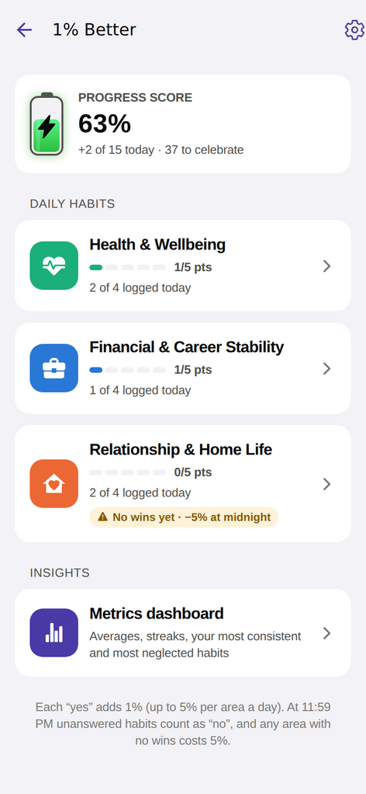
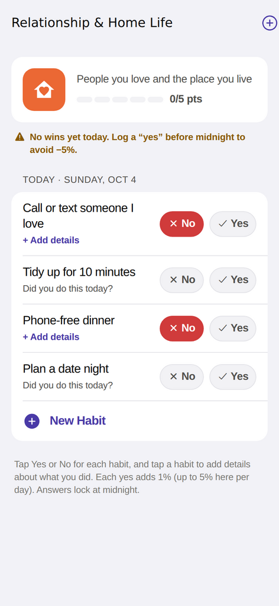
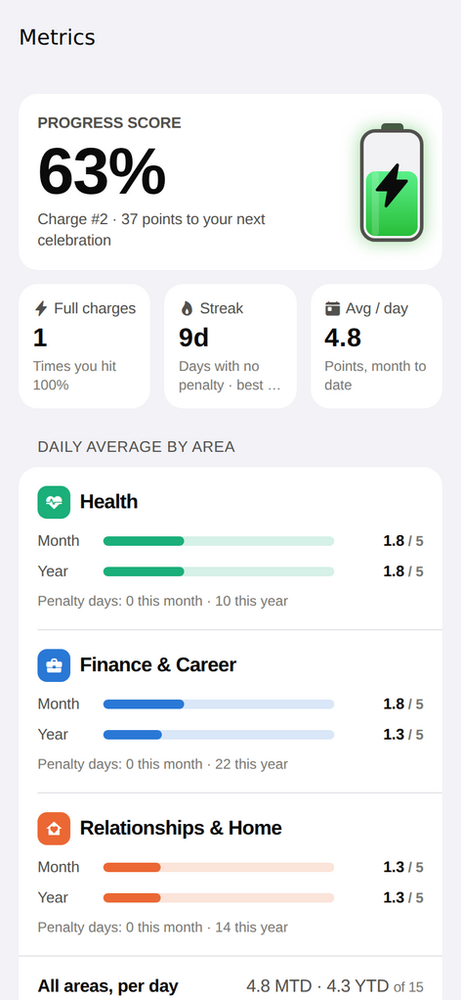
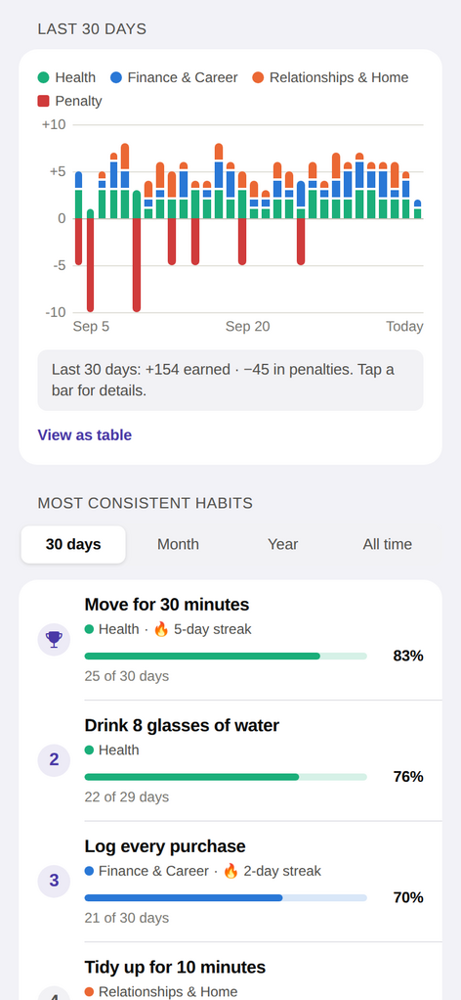
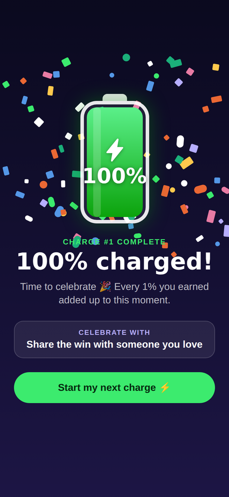

# 1% Better

**A daily habit and self-accountability tracker for iPhone.** Track daily habits in three areas of life and watch a battery meter charge from 0% to 100% as you show up for yourself. Every time it hits 100%, it's time to celebrate.

<p>
  
  
  
</p>
<p>
  
  
  
</p>

## Features

- **Charging welcome screen.** A battery fills from 0% up to your current progress score, with a pulsing bolt. Tap **Tap to continue** to open your habits. It also recaps yesterday ("+5 earned · no penalties") and today so far.
- **100% celebrations.** Reaching 100% sets off confetti, a haptic buzz and a suggested way to celebrate. The meter then starts your next charge, and any extra points carry over.
- **Three life areas:** Health & Wellbeing, Financial & Career Stability, and Relationship & Home Life.
- **Reminders-style habit lists.** Tap **+ New Habit**, type, and press return. The next blank row is ready right away, so you can add as many habits as you like. Starter ideas are one tap away.
- **Daily tracker.** Each habit gets **Yes** (goal met) or **No** (didn't happen), plus an optional **Details** note about what you did. Tap an answer again to undo it.
- **Metrics dashboard.**
  - Average daily points per area, month to date and year to date
  - A 30-day chart of points earned and penalties, with a table view
  - A leaderboard of your most consistent habits (30 days, month, year or all time)
  - Neglected habits and how many days since you last checked each one off
  - A 12-week consistency heatmap, your best days of the week, streaks, and lifetime totals
- **Daily reminders.** Turn on notifications and pick one or more times a day. They're scheduled on the phone itself, so no account or server is needed.
- Light and dark mode, haptics, VoiceOver labels, and all data stays on your device.

## How scoring works

| Rule | Detail |
| --- | --- |
| **+1% per yes** | Each "yes" adds 1 point, up to **5 points per area per day** (15 max). Points count right away. |
| **Midnight cutoff** | At 11:59 PM local time, anything you didn't answer counts as "no". Past days are locked. |
| **−5% per empty area** | Each area that has habits but **zero** "yes" answers that day costs 5 points. An area with no habits at all is never penalized. |
| **0% floor** | The score never drops below 0%. |
| **100% = celebrate** | Reaching 100% triggers the celebration. The meter keeps any overflow (97% + 5 → 2%) and the charge count goes up. |

Penalties are applied after that day's points, so a celebration you earned during the day is never taken back by that night's penalty. Deleting a habit archives it from that day on, so days you've already logged never change. The rules live in [`src/lib/scoring.ts`](src/lib/scoring.ts) and are covered by unit tests.

## Run it on your iPhone (free, no Mac needed)

The quickest way is **Expo Go**, a free App Store app that runs this project straight from your computer.

1. Install [Node.js](https://nodejs.org) (the LTS version) on your Mac, Windows or Linux computer. You don't need to open or run Node yourself; the commands below use it behind the scenes.
2. Open a terminal. On a Mac, that's the **Terminal** app (Applications → Utilities → Terminal).
3. Type these commands one at a time at the normal prompt (the line ending in `$` or `%`), pressing Return after each:
   ```bash
   git clone https://github.com/scottymcd/1-better.git
   cd 1-better
   npm install
   npx expo start
   ```
   - Don't type `node` first. That opens a JavaScript prompt (`>`) where these commands fail with `SyntaxError`. If you see a `>` prompt, press Ctrl+D twice to leave it.
   - On a Mac, the first `git` command may pop up an offer to install the "command line developer tools". Click **Install**, wait for it to finish, then run `git clone` again.
   - `npm install` takes a minute or two. Leave the terminal open while you use the app; press Ctrl+C to stop it.
4. On your iPhone, install **Expo Go** from the App Store and keep it up to date. This project uses Expo SDK 57.
5. Scan the QR code shown in the terminal with the iPhone Camera app. If Expo Go asks to find devices on your local network, tap **Allow**.

If your phone and computer aren't on the same Wi-Fi network, run `npx expo start --tunnel` instead. Next time, you only need to open Terminal and run `cd 1-better`, then `npx expo start`. Daily reminders and haptics work in Expo Go. Your data is saved on the phone between sessions.

## Install it as a standalone app (TestFlight / App Store)

You'll need an [Apple Developer account](https://developer.apple.com/programs/) ($99/year). [EAS Build](https://docs.expo.dev/build/introduction/) builds the iOS app in the cloud, so you still don't need a Mac.

1. In [`app.json`](app.json), change `ios.bundleIdentifier` (currently `com.onepercentbetter.tracker`) to an ID you own, such as `com.yourname.onepercentbetter`.
2. Build and upload:
   ```bash
   npx eas-cli@latest login
   npx eas-cli@latest build --platform ios --profile production
   npx eas-cli@latest submit --platform ios --latest
   ```
   EAS walks you through signing in with your Apple account and creating certificates. Once the build is processed, install it with TestFlight. For quick installs on your own device instead, use `--profile preview` (internal distribution).

## Development

```bash
npm start           # Expo dev server (scan the QR code with Expo Go)
npm run web         # browser preview (reminders and haptics are iPhone-only)
npm test            # unit tests (Jest): scoring, metrics, store, reminders
npm run lint        # ESLint
npm run typecheck   # TypeScript
```

Use `npx expo install <package>` to add dependencies, so versions match the Expo SDK.

### Project layout

```
src/
  app/                    Screens (Expo Router)
    index.tsx             Welcome screen: charging battery and "Tap to continue"
    menu.tsx              The three categories and the metrics dashboard entry
    category/[id].tsx     Habit list, Reminders-style add, Yes/No check-ins
    habit/[id].tsx        Today's answer and details, stats, history, rename, delete
    dashboard.tsx         Metrics dashboard
    settings.tsx          Reminder times, haptics, scoring rules, sample data
  components/             Battery meter, confetti, celebration, habit rows, charts
  lib/
    scoring.ts            Progress engine (the rules above)
    metrics.ts            Dashboard analytics
    notifications.ts      Daily local reminders (expo-notifications)
    dates.ts              Local-day keys and calendar maths
  state/                  Zustand store persisted with AsyncStorage, today/progress providers
```

The progress score is never stored. It's recomputed from your habits and answers whenever something changes, so it's always consistent with your history. To try the dashboard without waiting weeks, use **Settings → Load sample data**. This replaces your data with 75 days of example history.
